# CodeMan

A self-hosted **code-snippet manager**. Organize your snippets in a folder tree of
"pages"; each page holds collapsible sections; each section holds **code, note, rich-text,
and checklist** blocks with syntax highlighting, tags, search, trash & history, and a
quick-paste palette. Plain static files plus a small PHP API — **no build step, no
database, no external services.** Works offline, and optionally as a native desktop app.

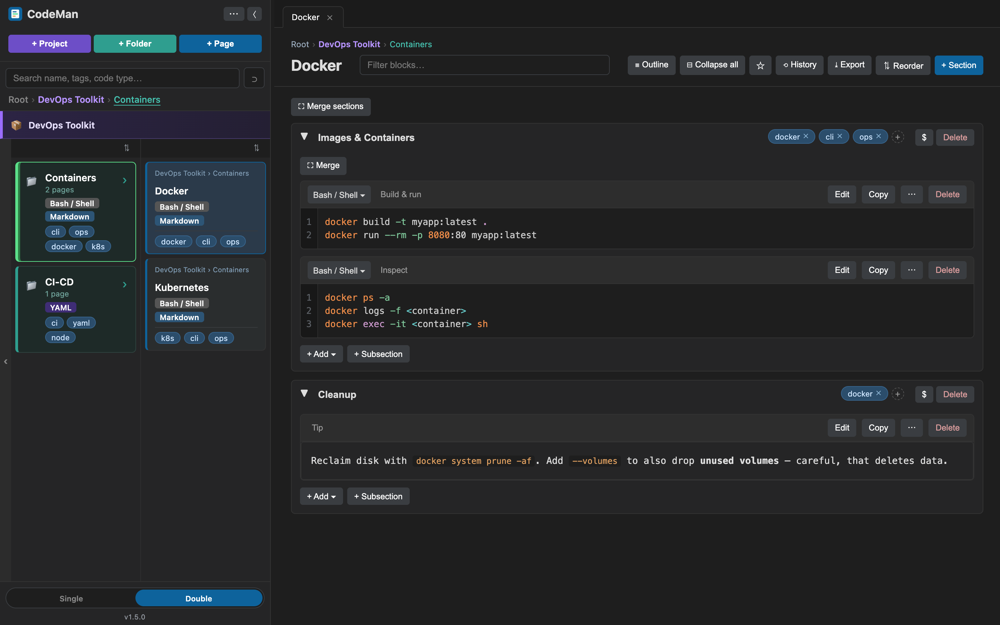

## Table of contents

- [What it is](#what-it-is)
  - [Architecture](#architecture)
- [Features](#features)
  - [Navigation and layouts](#navigation-and-layouts)
  - [Blocks of every kind](#blocks-of-every-kind)
  - [Search and organization](#search-and-organization)
  - [Productivity](#productivity)
  - [Data safety](#data-safety)
  - [Offline and desktop app](#offline-and-desktop-app)
- [Setup](#setup)
  - [1. Install the server](#1-install-the-server)
  - [2. Configure the server](#2-configure-the-server)
  - [3. Use it in a browser](#3-use-it-in-a-browser)
  - [4. Desktop app (macOS & Windows)](#4-desktop-app-macos--windows)
- [License](#license)

---

## What it is

CodeMan is a personal knowledge base built specifically for **code and command snippets**.
You browse a tree of folders and pages — much like Finder — and every page is a living
document made of collapsible **sections** and **subsections**. Inside a section you drop
**blocks**: syntax-highlighted code, Markdown notes, rich text, or checklists. Tag anything,
search by name/tag/language (or deep-search inside content), and every save is snapshotted
so you can diff and roll back.

It's **self-hosted and yours**: pages are stored as plain `.json` files on disk — no
database, no cloud, no account. The whole web app is static files served by any PHP host,
and it keeps working when the network blips (and, via the desktop app, when there's no
server at all).

### Architecture

```
codeman/          the web app + PHP API (this is what you host)
codeman-desktop/  optional desktop wrapper (Electron, macOS + Windows)
```

```
Browser  ─┐
          ├─►  http(s)://host/codeman/  ──►  api.php  ──►  CODEMAN_DATA/*.json
Desktop  ─┘     (static shell)            (PHP, no DB)      (outside web root)
  app          bundles the shell locally; proxies api.php to your server URL
```

- **No build step.** The `src/*.js` files are plain scripts loaded in order by
  `index.html`. Edit a file, reload the browser.
- **No database.** Each page is one `.json` file under `CODEMAN_DATA` (kept outside the web
  root). Folders mirror real directories; "projects" are just folders with a marker.
- **Vendored Prism** for syntax highlighting — no CDN, so highlighting works offline.
- **Tiny PHP API** (`api.php`): tree, page CRUD, move/reorder, search, trash, history,
  save-conflict detection, find & replace, with an optional password gate.
- **Offline-first.** A service worker precaches the shell; reads/writes mirror to IndexedDB
  and sync back on reconnect. The optional Electron app bundles the shell and proxies your
  server so it boots and works with no certificate setup at all.

---

## Features

### Navigation and layouts

Browse with a classic **single-column tree** or a windowed **double-column (Miller / Finder)**
layout — the desktop default — that shows two columns at a time with rich folder cards
(aggregated code-types, top tags, recursive counts). **Projects** are highlighted folders
that can nest inside other projects, with a color-coded breadcrumb. Drag to reorder, or sort
each column by name / code-type / kind. Open pages become tabs, and the full navigation state
persists across reloads.

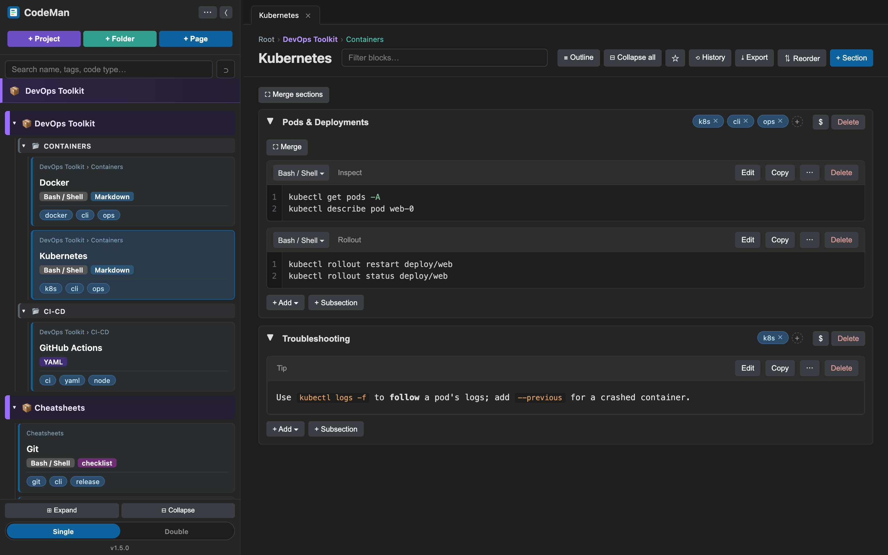

### Blocks of every kind

Each section holds a mix of block types:

- **Code** — syntax-highlighted (Prism, many languages), with per-block line numbers, a
  language picker, and a toolbar (Edit, Copy, Duplicate, Split, Delete).
- **Note** — Markdown prose with `[[cross-page links]]` and external links.
- **Rich text** — sanitized WYSIWYG HTML.
- **Checklist** — tickable items with progress.

Blocks also support **variables** (`_V_NAME_V_` fill-ins), **Copy as…** (raw / fenced /
escaped / one-line / vars-filled), and merge / split / reorder.

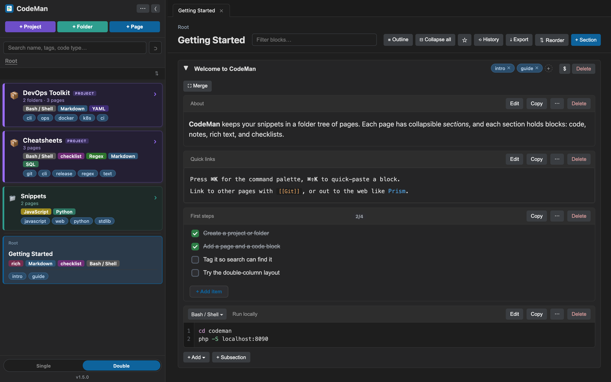

Variables turn a snippet into a reusable template — fill in the values and copy the
substituted result:

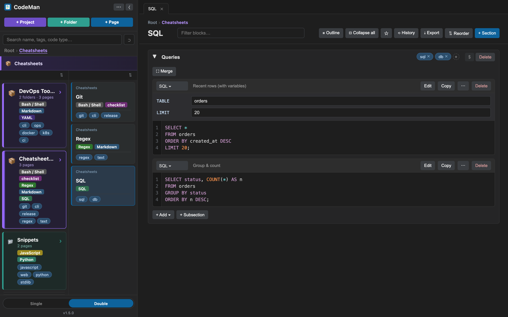

### Search and organization

Search by name, tag, or code-type instantly. Flip on the **deep-search toggle (⊃)** to also
scan inside page content:

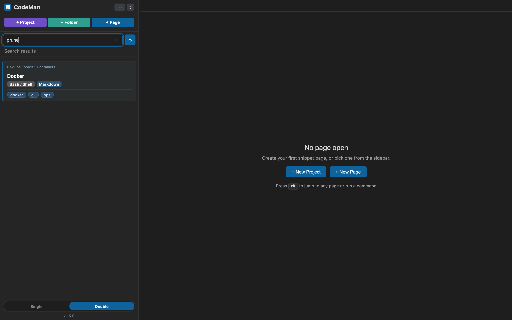

The **tag manager** lets you rename, merge, and delete tags across every page at once (open
tabs are reconciled so stale tags never sneak back in):

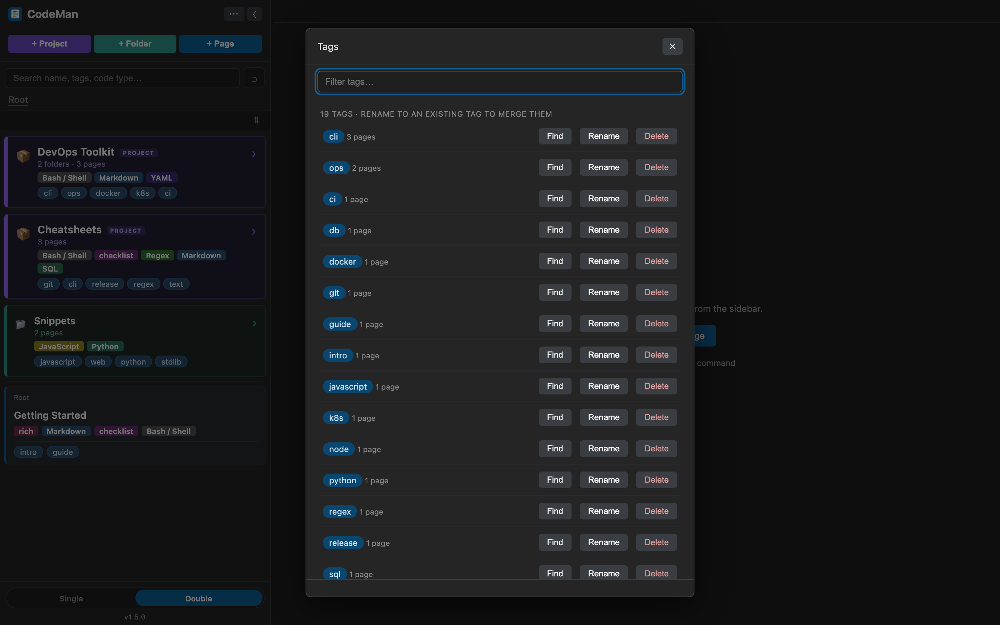

### Productivity

A **command palette (⌘K)** jumps to any page or runs a command; type `>` for command mode:

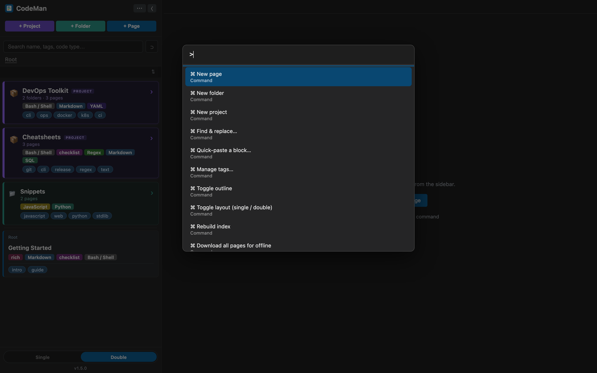

The **quick-paste palette (⌘⇧K)** finds any block across all pages and copies it in one keystroke:

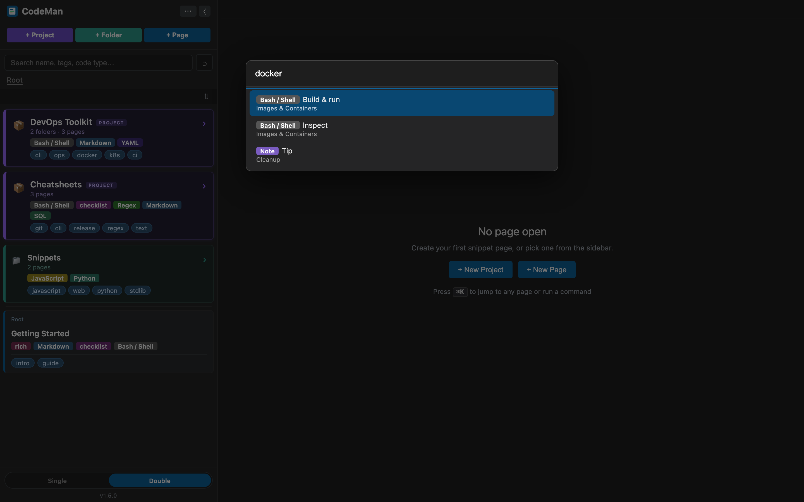

**Find & replace** works across every page — literal or regex, with a preview before you
commit (and each changed page is snapshotted to history first):

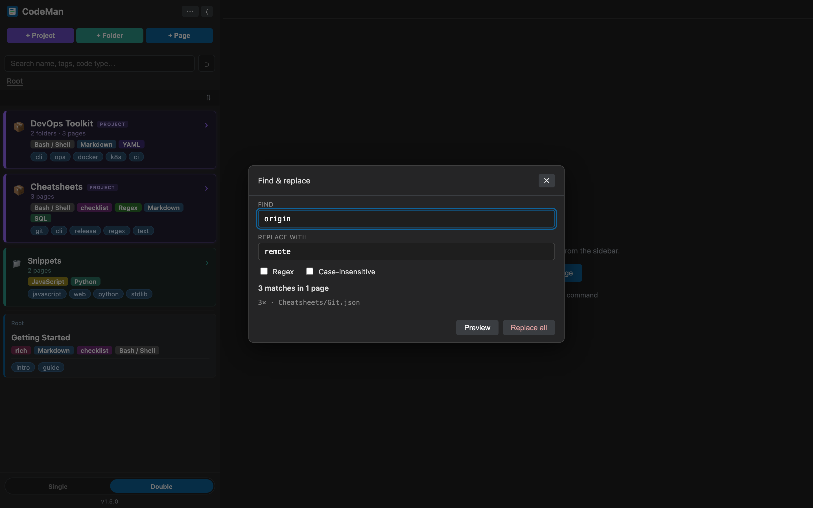

### Data safety

Nothing is lost by accident. Deletes go to a restorable **Trash**, every save snapshots the
prior version to **History** (last 20, with a line-level diff and one-click restore), and
concurrent edits are caught at save time — last-write-wins, but the other version is
snapshotted so it's always recoverable.

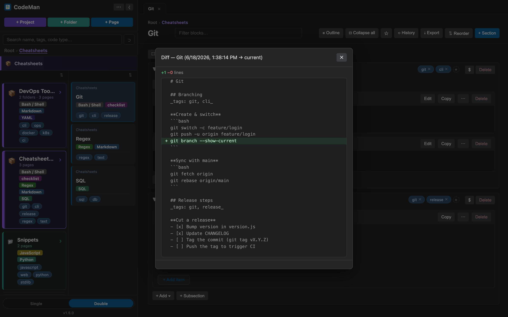

### Offline and desktop app

While a tab is open, edits keep working through a server blip — they mirror to IndexedDB and
replay on reconnect. A service worker precaches the shell for full offline boot over HTTPS.

For reliable offline use anywhere (no certificate, no PWA setup), the optional **Electron
desktop app** (macOS + Windows) bundles the shell locally and proxies your server. On first
launch it asks whether to connect a server or run **offline-only**:

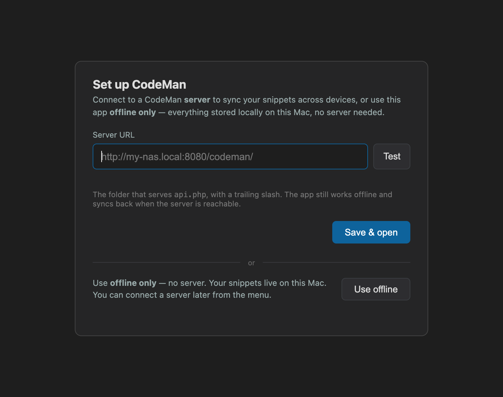

You can switch between a server and offline-only anytime from the settings panel — with a
connection test and safe data hand-off:

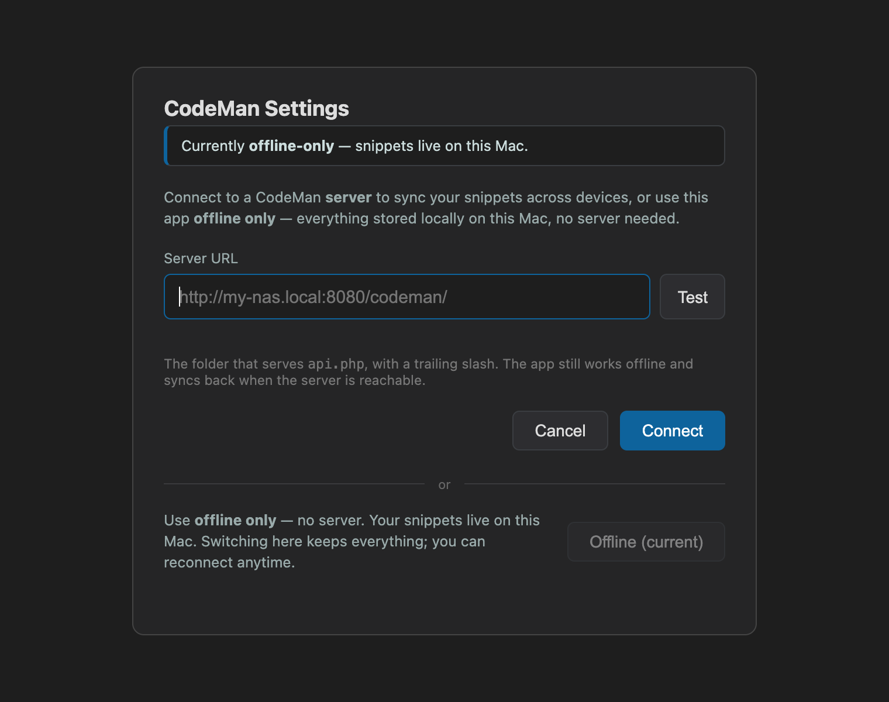

---

## Setup

The "server" is just the `codeman/` folder served by **any web server that can run PHP**
(PHP 7.4+). It has no database — pages are stored as `.json` files on disk.

### 1. Install the server

#### Quick start (local / testing)

```bash
cd codeman
php -S localhost:8090
```

Open <http://localhost:8090/>. With no configuration, data is written to
`codeman/structures/` (created automatically). Good for trying it out; for real use,
configure a data directory **outside** the web root (below).

#### Production (nginx + PHP-FPM)

1. Copy/clone the `codeman/` folder somewhere your web server serves, e.g. `/var/www/codeman`.
2. Make sure `*.php` is handled by PHP-FPM. A minimal nginx location:

   ```nginx
   root /var/www;                      # so /codeman/ resolves to /var/www/codeman

   location ~ \.php$ {
       include /etc/nginx/fastcgi_params;
       fastcgi_pass unix:/run/php/php-fpm.sock;   # your PHP-FPM socket
       fastcgi_param SCRIPT_FILENAME $document_root$fastcgi_script_name;

       # --- CodeMan configuration (see step 2) ---
       fastcgi_param CODEMAN_DATA /srv/codeman-data;   # data dir OUTSIDE the web root
       # fastcgi_param CODEMAN_PASSWORD changeme;       # optional auth (see below)
   }
   ```
3. Reload nginx. Visit `http://<host>/codeman/`.

> **Apache:** ensure PHP is enabled, then set the data dir with
> `SetEnv CODEMAN_DATA /srv/codeman-data` in your vhost/`.htaccess`.

#### NAS / Docker (e.g. linuxserver/nginx)

Same as above, but two gotchas:

- **Deliver config via `fastcgi_param`, not the container's environment variables.**
  PHP-FPM runs with `clear_env` on, so a `CODEMAN_DATA` set in the container's env list
  **never reaches PHP**. Put it in the nginx PHP `location` block as a `fastcgi_param`
  (as shown above), then restart the container.
- Put the data dir on a **persisted volume outside the web root**, e.g.
  `fastcgi_param CODEMAN_DATA /config/data/codeman;`

### 2. Configure the server

All configuration is environment variables, read by `codeman/api.php`:

| Variable | Required | What it does |
|----------|----------|--------------|
| `CODEMAN_DATA` | Recommended | Absolute path to the data directory (pages, `.trash/`, `.history/`, index). **Keep it outside the web root** so it's never web-served or committed. Defaults to `codeman/structures/` if unset. |
| `CODEMAN_PASSWORD` | Optional | If set, the API requires this shared secret on every request (`X-CodeMan-Auth` header, or `?token=`). The browser prompts once and remembers it (sign out any time via **Forget password** in the sidebar `⋯` menu). **Off by default** (open, for a trusted LAN). Set it if the app is reachable beyond your trusted network, and serve over HTTPS. |

Deliver them however your server passes env to PHP: real env vars (`getenv`),
`$_SERVER` (nginx `fastcgi_param`, Apache `SetEnv`), etc. `api.php` checks `getenv`
then `$_SERVER`, then falls back to the local `structures/` dir.

> **Why outside the web root?** Page data can contain anything you paste in. Keeping
> `CODEMAN_DATA` outside the served folder means the raw `.json` is never reachable over
> HTTP and never tracked by git.

#### Backups

Just back up the `CODEMAN_DATA` directory — it's all plain `.json` files. The app also
keeps a soft-delete `.trash/` and per-page `.history/` (last 20 versions) inside it.

### 3. Use it in a browser

Open `http://<host>/codeman/` in any modern browser. That's it — create projects,
folders, and pages; add code/note/checklist blocks; tag and search.

**Offline:** while a tab is open, edits keep working if the server blips (they're
mirrored to IndexedDB and synced back on reconnect). For full **offline boot** (opening
the app when the server is unreachable) the browser needs a *secure context* — i.e.
HTTPS with a trusted certificate, or `localhost`. Over plain HTTP on a LAN address the
service worker can't register, so use the **desktop app** below if you want reliable
offline away from the server.

> **Mobile shows "⚠ Offline" even though the server is up?** This usually means the
> page is loaded over a **self-signed HTTPS** origin (e.g. a `.local` name): mobile
> browsers often don't carry the manually-accepted certificate exception over to
> `fetch`/`XHR`, so API calls fail. The app **self-heals** (it re-probes the server
> and clears the badge once it's reachable — you can also tap the badge to force a
> recheck), but the reliable fix is to open it over **plain HTTP by IP**
> (`http://<lan-ip>:<port>/codeman/`) or use the desktop app, which avoids the
> certificate path entirely.

### 4. Desktop app (macOS & Windows)

`codeman-desktop/` wraps the UI in a small Electron app that **opens and works fully
offline** — it bundles the app shell locally and talks to your server only when
reachable. No certificate, no PWA setup required.

#### Install — macOS

1. Download the right `.dmg` for your Mac from the repo's **[Releases](../../releases)**
   page (built by CI): **`CodeMan-<v>-arm64.dmg`** for Apple Silicon (M-series) or
   **`CodeMan-<v>-x64.dmg`** for Intel Macs. Or build it yourself (below).
2. Open the `.dmg` and drag **CodeMan** into **Applications**. Eject the disk image.
3. **Clear the download quarantine** (required — see note). In Terminal:
   ```bash
   xattr -dr com.apple.quarantine /Applications/CodeMan.app
   ```
   Then open CodeMan normally.
4. macOS will ask to **allow Local Network access** — click **Allow** (required to reach
   a server on your LAN).

> **Why step 3?** The app is **unsigned and not notarized** (no paid Apple Developer
> account). macOS flags anything downloaded from a browser with a `com.apple.quarantine`
> attribute, and Gatekeeper then refuses unsigned apps — on Apple Silicon it reports them
> as **“CodeMan is damaged and can’t be opened.”** The app is *not* damaged; the `xattr`
> command above removes that flag and it opens fine. (The usual “right-click → Open” trick
> does **not** clear the *damaged* error — use the command.) If you'd rather avoid this
> step entirely, the app would need proper Developer ID signing + notarization.

#### Install — Windows

1. Download **`CodeMan-<v>.exe`** (the Windows x64 installer) from the
   **[Releases](../../releases)** page.
2. Run it. Because the build is **unsigned**, Windows SmartScreen will likely show
   **“Windows protected your PC.”** Click **More info → Run anyway** to continue — this is
   the Windows equivalent of the macOS step above.
3. The installer lets you choose the install location, then launches CodeMan. On first
   network access Windows may prompt to allow it through the firewall — allow it to reach
   a server on your LAN.

> **Why the SmartScreen prompt?** The installer has no code-signing certificate (the
> Windows analogue of Apple notarization), so SmartScreen flags an "unknown publisher."
> The app is safe; clicking **Run anyway** proceeds. Avoiding the prompt entirely would
> require a paid code-signing certificate.

#### First launch — connect a server or go offline-only

The desktop app is **not** hard-wired to a server. On first launch a setup screen lets you
choose:

- **Connect a server** — enter the URL of your CodeMan folder (the one serving `api.php`),
  e.g. `http://my-nas.local:8080/codeman/`, and click **Save & open**. The app shows live
  server data and syncs, and still works from its local cache when the server is unreachable.
- **Use offline only** — no server at all. Everything is stored locally on this Mac (in the
  app's own storage). Good for a personal scratchpad. You can connect a server later.

You can change either choice anytime from the menu: **CodeMan ▸ Server / Offline…**

The choice is stored per-machine in the OS user-data dir (`settings.json`), so the app
itself contains no personal URL. (Advanced: `CODEMAN_NAS_BASE` env overrides at launch.)

> Note: in **offline-only** mode the sync badge may show a growing "queued" count — that's
> normal; with no server, local edits just accumulate locally. If you later connect a
> server, those queued edits sync up to it.

#### Build from source

```bash
cd codeman-desktop
npm install
npm run dist:mac  # macOS → dist/CodeMan-<version>-arm64.dmg + CodeMan-<version>-x64.dmg
npm run dist:win  # Windows → dist/CodeMan-<version>.exe  (run on a Windows machine)
npm start         # run in dev without packaging
```

The macOS build produces **both** an Apple-Silicon (`arm64`) and an Intel (`x64`) `.dmg`
from one command on either kind of Mac (no native deps, so it just repackages the prebuilt
Electron binaries). The Windows NSIS installer must be built on Windows (`npm run
dist:win`). All builds are unsigned. App icons come from `codeman-desktop/build/`
(`icon.icns` / `icon.ico`, generated from `codeman/icon-maskable.svg`). Releases are
produced automatically by the GitHub Actions workflow
(`.github/workflows/codeman-desktop.yml`) — an OS matrix (macOS + Windows) that builds all
three artifacts — when you push a version tag, e.g.:

```bash
git tag v3.2.0 && git push origin v3.2.0
```

> **Run the tests:** open `codeman/tests.html` in a browser for the standalone unit tests
> (pure helpers, merge/diff/markdown, project helpers, offline reducers).

---

## License

[MIT](LICENSE) © Juan Felipe Garcia
